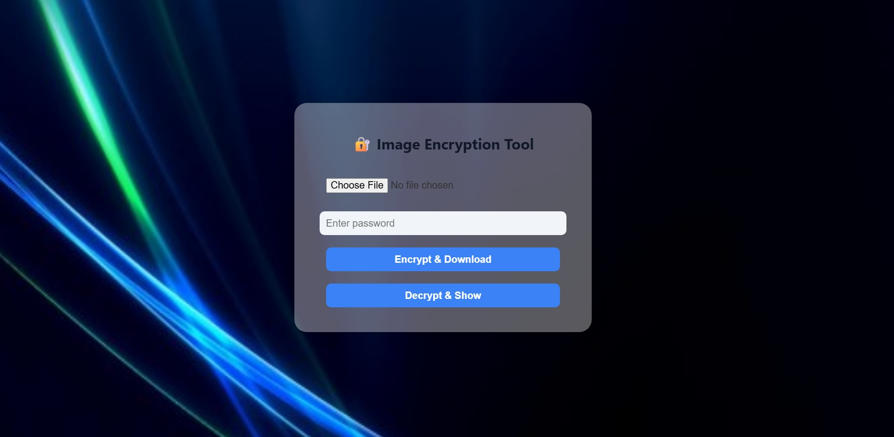

# 🔐 Image Encryption Tool (OpenPuff Style)

A modern, web-based image encryption and decryption tool built using **HTML**, **CSS**, and **JavaScript**. This client-side application allows users to securely encrypt and decrypt image files using **AES-GCM encryption**, all in the browser—no downloads or servers needed.

---

## 🌐 Live Preview

You can run the tool offline by simply opening `image-encryption.html` in your browser.

---

## 📸 Screenshot




---

## ✨ Features

- 🔐 **AES-GCM 256-bit encryption**
- 📁 Encrypts `.jpg`, `.png`, or any image file
- 🔑 Password-based encryption (PBKDF2 + SHA-256)
- 🧊 Glass-style transparent UI
- 📤 Download encrypted file (`.enc`)
- 📥 Upload encrypted file to decrypt and preview image
- ⚙️ 100% client-side – no data leaves your browser

---

## 🛠 Built With

- **HTML5**
- **CSS3** (with backdrop blur & frosted glass effect)
- **JavaScript** (Web Crypto API)

---

## 📂 How to Use

1. Clone or download this repository:
   ```bash
   git clone https://github.com/your-username/image-encryption-tool.git
   cd image-encryption-tool
